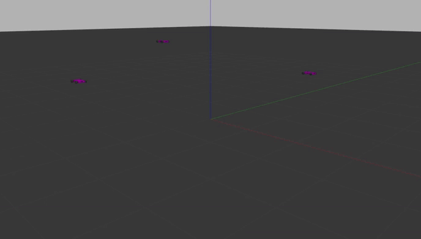
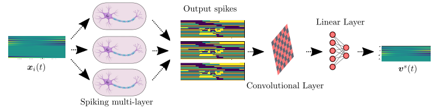

# Neuromorphic Collision Avoidance

```

   _____       _ _    _               _   _ _   _ 
  / ____|     (_) |  (_)             | \ | | \ | |
 | (___  _ __  _| | ___ _ __   __ _  |  \| |  \| |
  \___ \| '_ \| | |/ / | '_ \ / _` | | . ` | . ` |
  ____) | |_) | |   <| | | | | (_| | | |\  | |\  |
 |_____/| .__/|_|_|\_\_|_| |_|\__, | |_| \_|_| \_|
        | |                    __/ |              
        |_|                   |___/               
 
```

This repository contains the code used for last assignment of the course **FDD3558-Solving Engineering Problems with Neural-inspired Computation** (find [here](https://www.kth.se/student/kurser/kurs/FDD3558?l=en) the webpage of the course!)

## Objective
The objective of this project was to learn a collision avoidance policy for a multi-agent system composed of 7 Nexus robots set on collision paths with each other. A safe policy is learned by training a spiking neural network using the PyTorch-based package [Norse](https://norse.github.io/notebooks/intro_norse.html). The network is trained with a set of instances where each robot is controlled via a [Control Barrier Function](https://coogan.ece.gatech.edu/papers/pdf/amesecc19.pdf) (CBF)-enabled controller, ensuring that the agents follow collision-free trajectories. These expert demonstrations are then fed into the network.

In the video below, you can see an example of the learned policy. The rightmost agent (from the start of the video) is controlled by the neuromorphic controller, while the other agents are controlled by the standard CBF controller. The agents are on collision paths but successfully avoid collisions at all times.



You can see below the network architecture where the input $\boldsymbol{x}_i(t)$ is the i-th training instance  and $\boldsymbol{v}^s_i(t)$ is the predicted velocity output (the policy to learn). The input feature is given as a (26xtime) tensor representing relative position and velocity of the neighbouring agents as seen from one agent while it moves in the environment, plus one dimension representing the relative position to the desired goal location. The output in the time evolution of the predicted velocity to be given as a reference for each agent at each time step.




## Content of the repo :book:
In the `src` directory you can find the following

:rocket: `support_module.py`   : contains the main routines to run the simulations and store the dataset for training

:rocket: `create_dataset.py`   : starts simulations and extracts the data to create the dataset for the training. A dataset folder is created from this script

:rocket: `network_training.py` : after running `create_dataset.py` you can train the network with this function. Due to the large dimension of the training file this is not added in the repo and you will have to create the dataset first by running the  script `create_dataset.py`

:rocket: `simulation_with_network` : simulate some agents controller with a standard controller and other simulated with the neuromorphic controller

In order to run the simulations on Gazebo simulator you will have to follow the instructions given on the package I have created to run the simulations [here](https://github.com/gregoriomarchesini/neuromorphic_collision_avoidance)

# Installation

To run the scripts in the folder you will need to install the required python dependencies. You can do this using the `requirements.txt` file and the package manager `pip` (or other package managers of your choice).

```
pip install -r ./requirements.txt
```
Happy Coding :) :rocket: !! 
## Developer

Gregorio Marchesini [gremar@kth.se](mailto:gremar@kth.se)
